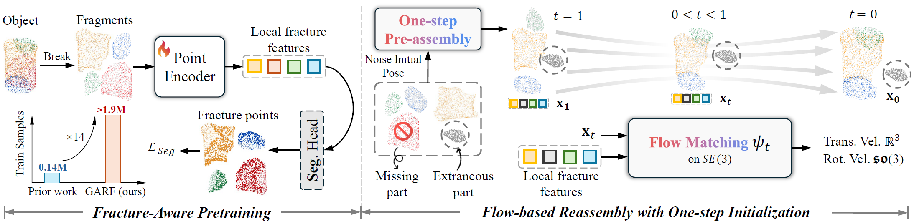

<p align="center">
  <h1 align="center">  GARF: Learning Generalizable 3D Reassembly </br> for Real-World Fractures </h1>
  <p align="center">
  A generalizable flow matching-based 3D reassembly method trained on 1.9 Million fractures, enabling precise real-world fragment pose alignment. 😊Achieves strong performance across extensive benchmarks, concise code with efficient performance.
  </p>
  <p align="center">
    <a href="https://ai4ce.github.io/GARF/static/GARF.pdf" target="_blank" rel="noopener noreferrer"></a>
    <a href="https://arxiv.org/abs/2504.05400" target="_blank"></a>
    <a href="https://ai4ce.github.io/GARF" target="_blank"></a>
    <a href='https://garf-demo.pages.dev' target="_blank"></a>
  </p>
  <p align="center">
    <a href="https://scholar.google.com/citations?user=90IoeJsAAAAJ">Sihang Li*</a>
    ·
    <a href="https://github.com/JDScript">Zeyu Jiang*</a>
    ·
    <a href="https://www.linkedin.com/in/grace-chen-37a974293/">Grace Chen†</a>
    ·
    <a href="https://www.linkedin.com/in/chenyang-xu-755125181">Chenyang Xu†</a>
    ·
    <a href="https://github.com/kevintsq">Siqi Tan</a>
    ·
    <a href="https://github.com/kevintsq">Xue Wang</a>
    ·
    <a href="https://github.com/irvingf7">Irving Fang</a>
    ·
    <a href="https://scholar.google.com/citations?user=aEmILscAAAAJ&hl=en">Kristof Zyskowski</a>
    ·
    <a href="https://scholar.google.com/citations?user=lo1VSPUAAAAJ&hl=en">Shannon McPherron</a>
    ·
    <a href="https://scholar.google.com/citations?user=JqLHsvYAAAAJ&hl=en">Radu Iovita</a>
    ·
    <a href="https://scholar.google.com/citations?hl=en&user=YeG8ZM0AAAAJ">Chen Feng✉</a>
    ·
    <a href="https://github.com/jingz6676">Jing Zhang✉</a>
  </p>
  <p align="center">
    *, † Equal contribution ✉ Corresponding author

<p align="center">
    
</p>

  <div align="center"></div>


## 🔊 News 
- `2025/03/25`: We release the <a href="https://ai4ce.github.io/GARF/" target="_blank">GARF</a>, which achieves state-of-the-art performance across a diverse range of synthetic and real-world benchmarks. Try our <a href="https://garf-demo.pages.dev/" target="_blank">demo</a> on your own data! 

## 📖 Table of Contents

- [📄 Documentation](#-documentation)
  - [⏩ Installation](#-installation)
  - [💾 Data Preparation](#-data-preparation)
  - [🎯 Evaluation](#-evaluation)
  - [🎮 Training](#-training)
  - [📂 Project Structure and Config System](#-project-structure-and-config-system)
  - [🎮 Visualization](#-visualization)
- [😺 Model Zoo](#-model-zoo)
- [✅ Evaluation Performance](#-evaluation-performance)
- [🙋 FAQs](#-faqs)
- [Citation](#citation)
- [License](#license)
- [Acknowledgement](#acknowledgement)


## 📄 Documentation


### ⏩ **Installation**
We recommend using [uv](https://docs.astral.sh/uv/) to manage the dependencies. Follow the instructions [here](https://docs.astral.sh/uv/getting-started/installation/) to install uv. Then, simply run
```bash
uv sync
uv sync --extra post
source ./venv/bin/activate
```
to install the dependencies and activate the virtual environment. Please be noted that `flash-attn` requires CUDA 12.0 or above and `pytorch3d` may need GPU available when installing it, or it will compile with no GPU support.

If you encounter any issue, you may try to re-install after removing the virtual environment at `.venv` and doing `uv clean` to remove the cache.

### 💾 **Data Preparation**
We will soon provide the script to process the raw Breaking Bad dataset into our hdf5 format, right now, you can directly download our processed dataset from following links. Fractura dataset will be released soon.
<table>
  <tr>
    <th>Dataset</th>
    <th>Link</th>
  </tr>
  <tr>
    <td>Breaking Bad</td>
    <td><a href="https://jdscript-my.sharepoint.com/:f:/g/personal/shared_jdscript_app/EqEvBJxkWcJOpLDqLTaYiQgBayhtJWEzwO7ftRUf6dMBMw?e=oREaca" target="_blank">OneDrive</a>
    <a href="https://drive.google.com/file/d/1dBc7QRjOXIuYm-ssZo59vSlMD29xF5eM/view?usp=drive_link" target="_blank">Google Drive</a></td>
  </tr>
  <tr>
    <td>Breaking Bad Volume Constrained</td>
    <td><a href="https://jdscript-my.sharepoint.com/:f:/g/personal/shared_jdscript_app/EqEvBJxkWcJOpLDqLTaYiQgBayhtJWEzwO7ftRUf6dMBMw?e=oREaca" target="_blank">OneDrive</a>
    <a href="https://drive.google.com/file/d/1vhYZGHNfunI3K5vTi9RtMugkUKdHSn5f/view?usp=drive_link" target="_blank">Google Drive</a></td>
  </tr>
  <tr>
    <td>Breaking Bad Other</td>
    <td><a href="https://jdscript-my.sharepoint.com/:f:/g/personal/shared_jdscript_app/EqEvBJxkWcJOpLDqLTaYiQgBayhtJWEzwO7ftRUf6dMBMw?e=oREaca" target="_blank">OneDrive</a>
    <a href="https://drive.google.com/file/d/1XO2BTCTkn9c9JPk95vkZk48rdEVlyoDd/view?usp=drive_link" target="_blank">Google Drive</a></td>
  </tr>
</table>

### 🎯 **Evaluation**
We provide the evaluation script in `scripts/eval.sh`, which looks like this:
```bash
EXPERIMENT_NAME="everyday_vol_one_step_init"
DATA_ROOT="../breaking_bad_vol.hdf5"
DATA_CATEGORIES="['everyday']"
CHECKPOINT_PATH="output/GARF.ckpt"

HYDRA_FULL_ERROR=1 python eval.py \
    seed=42 \
    experiment=denoiser_flow_matching \
    experiment_name=$EVAL_NAME \
    loggers=csv \
    loggers.csv.save_dir=logs/GARF \
    trainer.num_nodes=1 \
    trainer.devices=[0] \
    data.data_root=$DATA_ROOT \
    data.categories=$DATA_CATEGORIES \
    data.batch_size=64 \
    ckpt_path=$CHECKPOINT_PATH \
    ++data.random_anchor=false \
    ++model.inference_config.one_step_init=true
```
If you want to evaluation on our diffusion variant, you can simply change the `experiment` to `denoiser_diffusion`.

After running the script, the evaluation results will be stored in `logs/GARF/everyday_vol_one_step_init/`. In this folder, you could refer to `metrics.csv` for the evaluation results, and there's a `json_results` folder which contains the reassembly results for all test samples. 

**Currently, if you run the evaluation using multi-gpu, the `json_results` maybe incomplete, so we recommend using single gpu for evaluation.** We will fix this issue in the future.


### 🎮 **Training**
The training process is quite similar to the evaluation process. While you could directly run the training script provided below, we recommend getting familiar with our [project structure and config system](#project-structure-and-config-system) first.
#### ⭐ **Stage 1: Fracture-aware Pretraining**
```bash
NUM_NODES=4
DATA_ROOT="../breaking_bad_vol.hdf5"
DATA_CATEGORIES="['everyday']"
CHECKPOINT_PATH="output/pretraining.ckpt"

python train.py \
    experiment=pretraining_frac_seg \
    data.categories=$DATA_CATEGORIES \
    trainer.num_nodes=$NUM_NODES \
    data.data_root=$DATA_ROOT \
    ckpt_path=$CHECKPOINT_PATH # to resume training
```
#### ⭐ **Stage 2: Flow-Matching Training**
The difference here is that we will use the pretrained feature extractor to initialize the model, and we have to change the experiment into our flow-matching training.
```bash
NUM_NODES=4
DATA_ROOT="../breaking_bad_vol.hdf5"
DATA_CATEGORIES="['everyday']"
FEATURE_EXTRACTOR_CKPT="output/pretraining.ckpt"
CHECKPOINT_PATH="output/GARF.ckpt"

python train.py \
    experiment=denoiser_flow_matching \
    data.categories=$DATA_CATEGORIES \
    trainer.num_nodes=$NUM_NODES \
    data.data_root=$DATA_ROOT \
    model.feature_extractor_ckpt=$FEATURE_EXTRACTOR_CKPT \
    ckpt_path=$CHECKPOINT_PATH # to resume training
```
#### ⭐ **(Optional) Stage 3: LoRA-Based Fine-Tuning**
To start fine-tuning, the very first thing you need to do is to prepare your own dataset. The dataset should be in the same format as the Breaking Bad dataset, and you can use our provided script to convert it into hdf5 format. Then, you can run the following example script to start fine-tuning.
```bash
python train.py \
    experiment=finetune \
    experiment_name=finetune \
    data.categories="['egg']" \
    project_name="GARF" \
    trainer.num_nodes=$NUM_NODES \
    data.data_root=./finetune_egg.hdf5 \
    data.num_workers=8 \
    data.batch_size=32 \
    data.multi_ref=True \
    tags='["finetune", 'egg']' \
    ckpt_path=./xxx \
    finetuning=true
```


## 📂 Project Structure and Config System

```bash
.
├── assembly
│   ├── backbones        # Backbones used for feature extraction
│   ├── data             # Data processing module
│   └── models
│       ├── denoiser     # Denoising models
│       └── pretraining  # Pretraining module
├── configs              # Configuration files directory
├── eval.py              # Evaluation script
├── train.py             # Training script
└── vis.py               # Visualization script
```
All the configuration files are stored in the `configs` folder. The config system is based on [Hydra](https://hydra.cc/docs/intro/), which allows you to easily modify the configurations by changing the YAML files. You can also override the configurations by passing command line arguments when running the script. We hugely utilize the config system for the initialization of all the modules. You could refer to `configs/models` to see the configuration files for different models. The `configs/experiments` folder serves as a global override configuration for the training and evaluation scripts.

### 🎮 **Visualization**
After running the evaluation, per sample transformations will be saved in `logs/GARF/{EXPERIMENT_NAME}/json_results/`. Using the transformation saved in the json, you can firstly apply the inverse of gt transformation to the fragments to get the model input, and then apply the model output transformations to the fragments to get the the final output. We'll soon provide a script and sample to visualize the results.

<!-- ### 🎮✒️📂🗂️📝📦🎯💾⏩🌈🌟⭐🥑♣️♠️♟️🎮✨🏷️📍📌✈️ Data Preparation -->

## 😺 Model Zoo
<table>
  <tr>
    <th>Model Name</th>
    <th>Model</th>
    <th>Note</th>
  </tr>
  <tr>
    <td>GARF-mini</td>
    <td><a href="https://drive.google.com/file/d/1owxt6JGhVcr_nNzqgYTjHbLM1nzLI_F0/view?usp=drive_link">GARF-mini-E-FM</a></td>
    <td>pretrained on everyday subset of Breaking Bad with Flow-matching model. </a></td>
  </tr>
  <tr>
    <td>GARF-mini-diffusion</td>
    <td><a href="https://drive.google.com/file/d/1aSKR3SF_rrsEN8w1R_7vR4WDVrkf5a7-/view?usp=sharing">GARF-mini-E-Diff</a></td>
    <td>replace the Flow-matching model with Diffusion model</td>
  </tr>
  <tr>
    <td>GARF</td>
    <td><a href="https://drive.google.com/file/d/1ZN0-Y2HaVe6zI7q4xUVVvhbSqKGbORfg/view?usp=drive_link">GARF-EAO-FM</a></td>
    <td>large-scale trained on everyday+artifact+other subsets of Breaking Bad for both backbone and Flow-matching (cost most time!)</a></td>
  </tr>
</table>


## ✅ Evaluation Performance
| Dataset | Subset | Model | RMSE(R) ↓ | RMSE(T) ↓ | Part Accuracy ↑ |
| ------- | ------ | ----- | --------- | --------- | ---------------- |
| Breaking Bad Vol | Everyday | GARF | 5.32 | 1.14 | 95.68% |
| Breaking Bad Vol | Everyday | GARF-mini | 6.68 | 1.34 | 94.77% |
| Breaking Bad Vol | Artifact | GARF | 3.64 | 0.88 | 96.78% |
| Breaking Bad Vol | Artifact | GARF-mini | 7.67 | 1.77 | 93.34% |

## 🙋 FAQs
For frequently asked questions, please refer to our [GitHub Issues](https://github.com/ai4ce/GARF/issues) page. You can search existing issues or create a new one if you don't find an answer to your question.

## Citation
If you find this project useful, please consider citing our paper:
```bibtex
@article{Li2025GARF,
 title={GARF: Learning Generalizable 3D Reassembly for Real-World Fractures},
 author={Sihang Li and Zeyu Jiang and Grace Chen and Chenyang Xu and Siqi Tan and Xue Wang and Irving Fang and Kristof Zyskowski and Shannon McPherron and Radu Iovita and Chen Feng and Jing Zhang},
 year={2025},
 journal={arXiv preprint arXiv:2504.05400},
}
```

Our codebase and method implementation are based on the excellent work by [PuzzleFusion++](https://github.com/eric-zqwang/puzzlefusion-plusplus) and [PointTransformerV3](https://github.com/Pointcept/PointTransformerV3), which provided valuable foundations and insights.

## License
This project is licensed under the GPL License. See the [LICENSE](LICENSE) file for details.

## Acknowledgement
 We gratefully acknowledge the Physical Anthropology Unit, Universidad Complutense de Madrid for providing access to the human skeletons under their curation. This work was supported in part through NSF grants 2152565, 2238968, 2322242, and 2426993, and the NYU IT High Performance Computing resources, services, and staff expertise. 

```bibtex
@article{li2025garf,
 title={GARF: Learning Generalizable 3D Reassembly for Real-World Fractures},
 author={Li, Sihang and Jiang, Zeyu and Chen, Grace and Xu, Chenyang and Tan, Siqi and Wang, Xue and Fang, Irving and Zyskowski, Kristof and McPherron, Shannon P and Iovita, Radu and Feng, Chen and Zhang, Jing},
 year={2025},
 journal={arXiv preprint arXiv:2504.05400},
}
```
